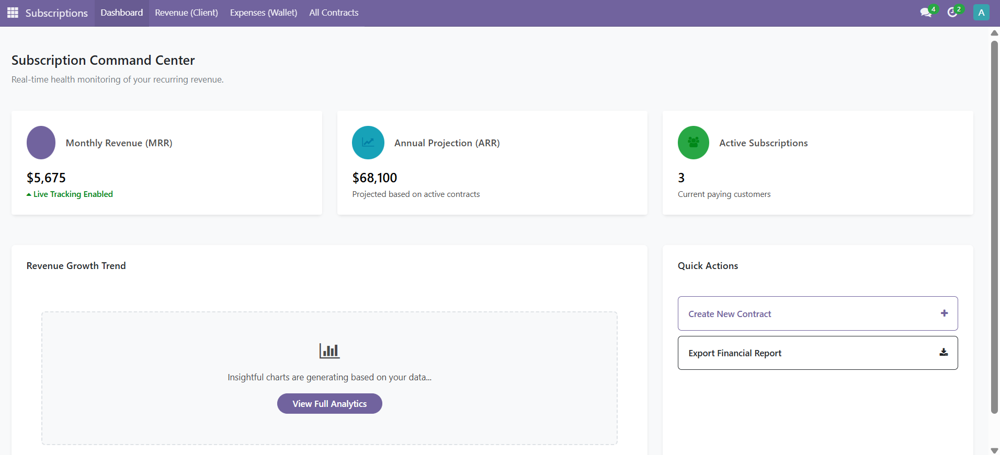

# Subscriptions: Ultimate Multi-Level Follow-Up & Analytics

**A high-performance standalone module that transforms Odoo into a powerful subscription recurring engine.**

Odoo Enterprise charges thousands per year for subscription management. This module brings the same capability to the **Community edition** — with a Command Center dashboard, automated billing, customer portal, and dual-direction tracking for both your revenue and your own business costs.

## 🌟 Key Features

*   **Command Center Dashboard**: Live MRR, ARR, and active contract KPIs on your home screen the moment you open the app.
*   **Dual Direction Tracking**: Manage both incoming client revenue and outgoing business costs in one module. MRR is calculated from revenue only.
*   **Contract Line Bundles**: Multiple products in a single contract with individual qty, price, discount, and subtotal per line.
*   **Auto-Invoice on Renewal**: Generate, validate, and send the invoice automatically at the point of renewal. Zero manual steps required.
*   **Configurable Reminders**: Per-contract email alerts sent X days before renewal, powered by a daily scheduled job.
*   **Self-Service Customer Portal**: Customers view their subscriptions, renewal dates, and itemised charges — and can self-cancel — directly from their portal login.
*   **Financial Report Export**: Export your MRR/ARR report to PDF, download raw data as CSV, or send directly to a printer from the dashboard.
*   **Community Compatible**: Depends only on `base`, `mail`, `account`, and `product` — **No Enterprise modules required.**

## 📊 Analytics & Tracking

*   **Revenue Trend Analysis**: Built-in line charts track your MRR growth over time.
*   **Pivot Tables**: Slice revenue by Direction (Revenue vs. Expense), Status, or Frequency effortlessly.
*   **Automated Audit Trail**: Every renewal, pause, or resume event is logged accurately in the document chatter.

## ⚙️ Technical Details

*   **Odoo Version**: 17.0
*   **License**: OPL-1
*   **Dependencies**: `base`, `mail`, `account`, `product`
*   **Enterprise Required**: No

## 📞 Support & Contact

Developed by **Brimstone Tech**
*   **Email**: brimstonetech1@gmail.com
*   **Phone**: +256 744 429 293
